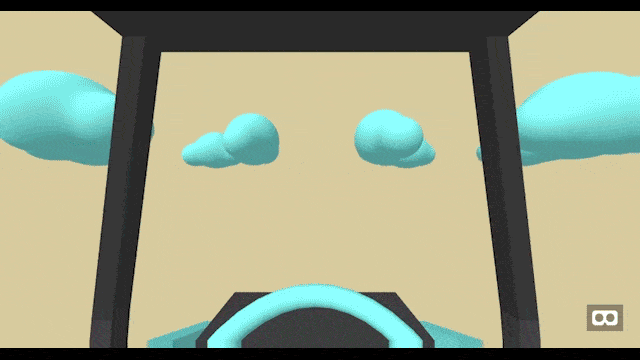

# Never Ending VR Walk Experiment

The never-ending walk VR Walk is my playground built using the simple and powerful [A-Frame](https://aframe.io/), where I experiment with 3D models created in Cinema 4D, keeping in mind a low poly and minimal colors ambient. Using the well-known A-Frame framework, you can put on your cardboard Google compatible equipment, sit down and look around in this relaxing environment. The usage of relaxed ambient music is recommended.

> **Note:** This project has been modernized from Gulp to Vite! See [MIGRATION.md](MIGRATION.md) for details.

## Quick Start

### Development

Start the development server with hot module reloading:

```bash
npm install          # Install dependencies
npm run dev          # Start dev server at http://localhost:8080
```

Changes to HTML, JavaScript, or SCSS will update instantly!

### Building for Production

Build optimized files for deployment:

```bash
npm run build        # Build to docs/ folder (ready for GitHub Pages)
npm run preview      # Preview production build locally
```

## Project Structure

```
never-ending-walking-vr/
├── src/                      # Source files (edit these)
│   ├── index.html           # Main HTML
│   ├── javascript/
│   │   └── main.js          # JavaScript entry (ES modules)
│   └── stylesheet/
│       └── styles.scss      # Styles (Bootstrap 5 + custom)
│
├── public/                   # Static assets (copied as-is)
│   └── assets/
│       ├── images/          # Images and icons
│       └── threedmodels/    # GLTF 3D models
│
├── docs/                     # Build output (GitHub Pages)
│   ├── index.html
│   └── assets/              # Bundled JS, CSS, and static files
│
├── vite.config.js           # Vite configuration
└── package.json             # Dependencies & scripts
```

## Tech Stack

### Framework & Libraries
- **[A-Frame](https://aframe.io/)** (v1.7.1) - WebVR framework with latest WebXR support
- **[Vite](https://vitejs.dev/)** - Modern build tool with instant HMR

### A-Frame Components
- [aframe-template-component](https://github.com/ngokevin/kframe/tree/master/components/template/) - Template system
- **Custom Preloader** - Vanilla JS asset loading (no jQuery dependency)

## Features

✨ **Modern Development Experience**
- ⚡ Lightning-fast dev server with Vite
- 🔥 Instant hot module reloading (HMR)
- 📦 Optimized production builds
- 🎨 Modern SCSS compilation

🎮 **VR Experience**
- Low-poly 3D models optimized for performance
- Minimal color palette for a calming atmosphere
- Cardboard Google VR compatible
- Smooth animations with rotating elements

## Development

### Adding New Features

**Add a JavaScript module:**
```javascript
// src/javascript/myModule.js
export function myFunction() { }

// src/javascript/main.js
import { myFunction } from './myModule.js';
```

**Add styles:**
```scss
// src/stylesheet/styles.scss
@import './components/my-component';
```

**Add static assets:**
Place files in `public/assets/` - they'll be copied to `docs/assets/`

## Technical Notes

- **Custom Preloader** - Lightweight vanilla JavaScript implementation that tracks A-Frame asset loading without jQuery dependencies
- **Preloader animation** from [SpinKit](https://github.com/tobiasahlin/SpinKit), customized and optimized
- **glTF 2.0 models** exported using Blender plugins, following the [Khronos glTF 2.0 specification](https://github.com/KhronosGroup/glTF)
- **Build output** goes to `docs/` folder for seamless GitHub Pages deployment
- **No external dependencies** for UI - pure CSS for modal and loading screen

## Browser Support

Works on all modern browsers that support WebVR/WebXR:
- Chrome/Edge (latest)
- Firefox (latest)
- Safari (latest)
- Mobile browsers with VR support

## Troubleshooting

**Dev server won't start:**
```bash
rm -rf node_modules package-lock.json
npm install
npm run dev
```

**Changes not showing:**
Hard refresh: `Ctrl+Shift+R` (Windows/Linux) or `Cmd+Shift+R` (Mac)

## Migration from Gulp

This project was recently modernized from Gulp + Webpack to Vite. Key improvements:
- 10x faster development server
- Instant hot module reloading
- Modern ES modules instead of CommonJS
- Simplified configuration
- Better error messages

See [MIGRATION.md](MIGRATION.md) for complete migration details.

## Find Me

Find me at [MeSopa](https://mesopa.com/) and check out my other works.  
Thanks!

## License

MIT